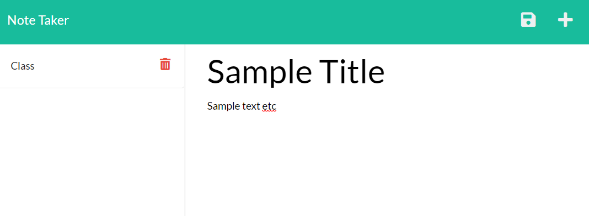

# Note-Taker

## Description
I built this application to learn about how to design the backend of a javascipt application, as well as how to connect the frontend and backend properly. I also learned how to use heroku to deploy an application. 

This is a useful tool for quickly taking and saving notes, and can be used for taking notes in class or just creating a grocery list. Currently there is no way to delete notes once you have saved them, but I will add that as a feature later.

## Usage
See screenshot below. In the middle of the page are fields where you can enter the title and text for a note. Once you have written something, a save button will appear in the upper left corner. Once a note is saved it will be added to the list on the left. The delete buttons currently do not do anything. To start a new note, click the plus button in the upper right.

   
## Credits
This application requires express to run, and was deployed using heroku.

## License
Copyright (c) 2021 Gabriel Guerin

Permission is hereby granted, free of charge, to any person obtaining a copy of this software and associated documentation files (the "Software"), to deal in the Software without restriction, including without limitation the rights to use, copy, modify, merge, publish, distribute, sublicense, and/or sell copies of the Software, and to permit persons to whom the Software is furnished to do so, subject to the following conditions:

The above copyright notice and this permission notice shall be included in all copies or substantial portions of the Software.

THE SOFTWARE IS PROVIDED "AS IS", WITHOUT WARRANTY OF ANY KIND, EXPRESS OR IMPLIED, INCLUDING BUT NOT LIMITED TO THE WARRANTIES OF MERCHANTABILITY, FITNESS FOR A PARTICULAR PURPOSE AND NONINFRINGEMENT. IN NO EVENT SHALL THE AUTHORS OR COPYRIGHT HOLDERS BE LIABLE FOR ANY CLAIM, DAMAGES OR OTHER LIABILITY, WHETHER IN AN ACTION OF CONTRACT, TORT OR OTHERWISE, ARISING FROM, OUT OF OR IN CONNECTION WITH THE SOFTWARE OR THE USE OR OTHER DEALINGS IN THE SOFTWARE.
